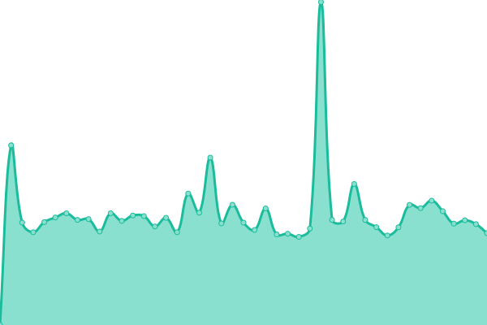

# [📈 Live Status](https://statuspage.krea.edu.in): <!--live status--> **🟩 All systems operational**

This repository contains the open-source uptime monitor and status page for [Krea University](https://statuspage.krea.edu.in), powered by [Upptime](https://github.com/upptime/upptime).

With [Upptime](https://upptime.js.org), you can get your own unlimited and free uptime monitor and status page, powered entirely by a GitHub repository. We use [Issues](https://github.com/Krea-University/upptime/issues) as incident reports, [Actions](https://github.com/Krea-University/upptime/actions) as uptime monitors, and [Pages](https://statuspage.krea.edu.in) for the status page.

<!--start: status pages-->
<!-- This summary is generated by Upptime (https://github.com/upptime/upptime) -->
<!-- Do not edit this manually, your changes will be overwritten -->
<!-- prettier-ignore -->
| URL | Status | History | Response Time | Uptime |
| --- | ------ | ------- | ------------- | ------ |
|  [Main Website](https://krea.edu.in) | 🟩 Up | [main-website.yml](https://github.com/Krea-University/upptime/commits/HEAD/history/main-website.yml) | 

 130ms
     
 | 

<a href="https://statuspage.krea.edu.in/history/main-website">100.00%</a>
    

|  [One ERP Frontend](https://oneerp.krea.edu.in) | 🟩 Up | [one-erp-frontend.yml](https://github.com/Krea-University/upptime/commits/HEAD/history/one-erp-frontend.yml) | 

 195ms
     
 | 

<a href="https://statuspage.krea.edu.in/history/one-erp-frontend">100.00%</a>
    

|  [ERP Frontend](https://erp.krea.edu.in) | 🟩 Up | [erp-frontend.yml](https://github.com/Krea-University/upptime/commits/HEAD/history/erp-frontend.yml) | 

 177ms
     
 | 

<a href="https://statuspage.krea.edu.in/history/erp-frontend">100.00%</a>
    

|  [Main Website Webserver](https://hostinger.krea.edu.in) | 🟩 Up | [main-website-webserver.yml](https://github.com/Krea-University/upptime/commits/HEAD/history/main-website-webserver.yml) | 

 1273ms
     
 | 

<a href="https://statuspage.krea.edu.in/history/main-website-webserver">98.16%</a>
    

|  [ERP API](https://api.erp.krea.edu.in/heartbeat) | 🟩 Up | [erp-api.yml](https://github.com/Krea-University/upptime/commits/HEAD/history/erp-api.yml) | 

 548ms
     
 | 

<a href="https://statuspage.krea.edu.in/history/erp-api">100.00%</a>
    

<!--end: status pages-->

[**Visit our status website →**](https://statuspage.krea.edu.in)

## 📄 License

- Powered by: [Upptime](https://github.com/upptime/upptime)
- Code: [MIT](./LICENSE) © [Anand Chowdhary](https://anandchowdhary.com), supported by [Pabio](https://pabio.com)
- Data in the `./history` directory: [Open Database License](https://opendatacommons.org/licenses/odbl/1-0/)
